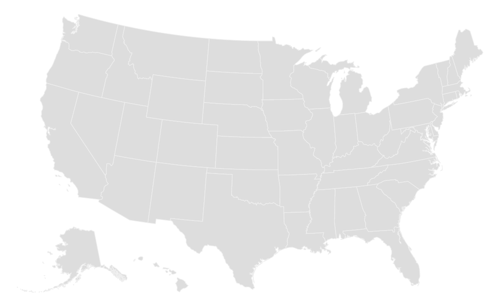

# MapChart Documentation

## General Notes
This chart requires the TopoJSON file in order to be used. In our example we created the United States map with [this TopoJSON file](../data/us.json). 
-- say something about data join stuff and other required info

