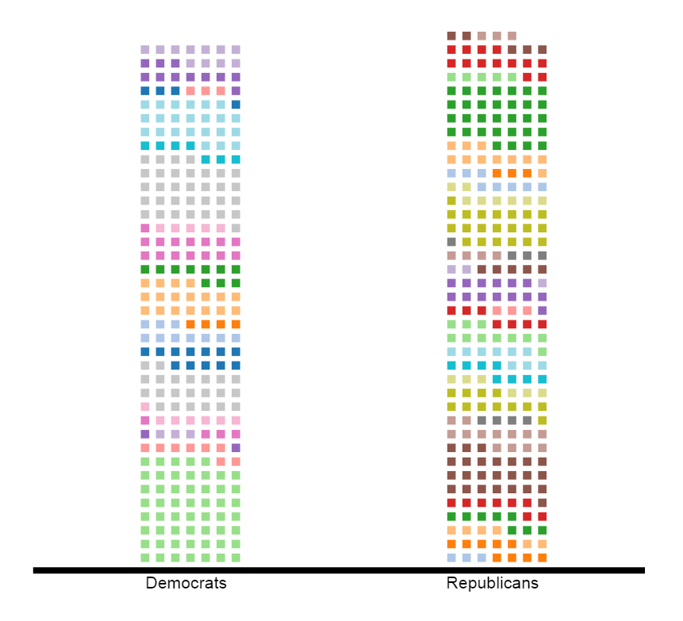

# PebbleChart Documentation/API

## General Notes
PebbleChart is an original chart inspired by waffle chart and bar chart. PebbleChart allows the user to visualize the data, grouped or not, separately and distinctly. It is a way to encode the data discretely in a chart like a bar chart. 

##  PebbleChart Functions

\# PebbleChart().width(n)
> Sets PebbleChart's width to n (pixels). Default is 450.

\# PebbleChart().height(n)
> Sets PebbleChart's height to n (pixels). Default is 500.

\# PebbleChart().squareSize()
> Sets the sizes of the squares in pixels. Default is 8.

\# PebbleChart().squareMargin(n)
> Sets PebbleChart's mmargins between squares to n (pixels). Default is 5.

\# PebbleChart().squareCols(n)
> Sets PebbleChart's max number of columns to n. Default is 7.

\# PebbleChart().colors(n)
> Sets PebbleChart's color's scale. Default is d3.scale.category20().

\# PebbleChart().transitionDelay(n)
> Sets PebbleChart's watefalling transition delay. Default is 1500ms.
